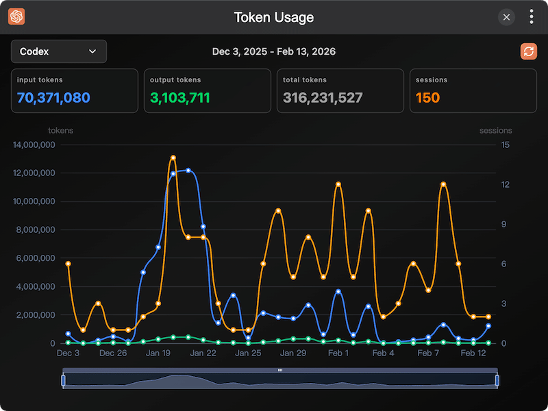

# TINKER Official Plugins

This repository contains officially maintained non-built-in [TINKER](https://github.com/liriliri/tinker) plugins.

## Plugins

All plugins in the list can be installed to TINKER by running `npm i -g tinker-xxx`.

<table width="100%" style="text-align:center">
  <colgroup>
    <col width="50%">
    <col width="50%">
  </colgroup>
  <tbody>
    <tr>
      <th><a href="./packages/tinker-token-usage/">tinker-token-usage</a></th>
      <th><a href="https://github.com/liriliri/tinker-whois">tinker-whois</a></th>
    </tr>
    <tr>
      <th></th>
      <th></th>
    </tr>
  </tbody>
</table>